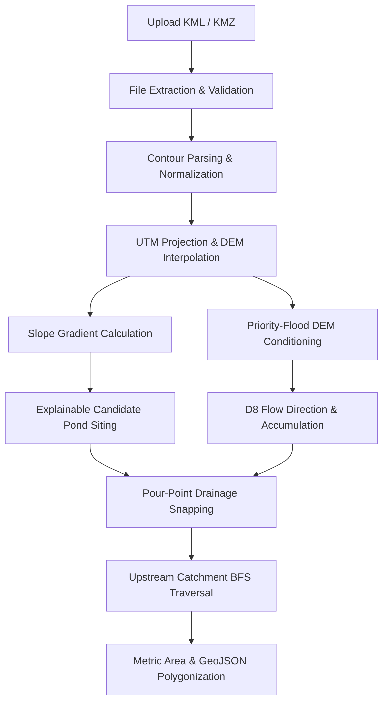

# AI-Based Village Pond Planning System - Backend (Assignment 1 Phase 2)

A modular, extensible FastAPI backend service for the AI-based Village Pond Planning System. This system processes village contour maps (uploaded in KML or KMZ formats) to dynamically reconstruct continuous digital elevation models (DEM), model surface slopes, identify promising candidate pond regions using explainable terrain criteria, simulate hydrological drainage via D8 flow modeling, and delineate upstream catchment boundaries and metric drainage areas formatted as GeoJSON.

---

## Deployment Status & Live Service

[](https://pond-catchment-backend.onrender.com/docs)
[](https://pond-catchment-backend.onrender.com/docs)
[](https://pond-catchment-backend.onrender.com/docs)

The backend service is actively deployed and hosted live on **Render**:

| Resource | Live URL | Status | Description |
| :--- | :--- | :--- | :--- |
| **Interactive API Docs (Swagger UI)** | [https://pond-catchment-backend.onrender.com/docs](https://pond-catchment-backend.onrender.com/docs) | `200 OK` | Interactive testing of all endpoints |
| **Alternative Docs (ReDoc)** | [https://pond-catchment-backend.onrender.com/redoc](https://pond-catchment-backend.onrender.com/redoc) | `200 OK` | Schema & OpenAPI specification |
| **Root Service Status** | [https://pond-catchment-backend.onrender.com/](https://pond-catchment-backend.onrender.com/) | `200 OK` | Service metadata and version |
| **Health Check Endpoint** | [https://pond-catchment-backend.onrender.com/api/v1/health](https://pond-catchment-backend.onrender.com/api/v1/health) | `200 OK` | System liveness probe |
| **Catchment Analysis Endpoint** | `POST https://pond-catchment-backend.onrender.com/api/v1/findCatchment` | `Active` | Production terrain & catchment pipeline |

---

## Architecture & Modular Structure

The backend follows clean architectural principles where the API route layer orchestrates dedicated, single-responsibility services. Every result is derived dynamically from input files without hard-coded coordinates, elevation values, bounds, or areas.

```text
pond_catchment_backend/
├── app/
│   ├── api/
│   │   └── v1/
│   │       ├── endpoints/
│   │       │   ├── health.py             # System liveness and health check endpoint
│   │       │   └── catchment.py          # Route orchestrator for /findCatchment & /analyzeContour
│   │       └── api.py                    # V1 API router aggregator
│   ├── core/
│   │   └── config.py                     # Environment-driven settings (pydantic-settings)
│   ├── models/                           # Domain models & database entity schemas
│   ├── schemas/
│   │   ├── health.py                     # Health check schemas
│   │   └── catchment.py                  # Pydantic schemas: Contours, DEM, Candidates, Catchment, GeoJSON
│   ├── services/
│   │   ├── parser.py                     # KML/KMZ unpacking, XML parsing, & contour normalization
│   │   ├── terrain.py                    # Dynamic UTM projection, DEM interpolation, & slope calculation
│   │   ├── candidate_selection.py        # Explainable multi-factor candidate pond siting & ranking
│   │   └── hydrology.py                  # Priority-Flood sink filling, D8 flow, snapping, & catchment delineation
│   ├── utils/
│   │   └── file_handler.py               # File extension & archive validation utilities
│   └── main.py                           # FastAPI application entry point, CORS, & routers
├── data/
│   └── sample/                           # Sample contour datasets
│       └── contours_1m.kml               # 1,355 contour lines (1m interval, 267m - 298m elevation)
├── tests/
│   ├── conftest.py                       # Pytest fixtures and TestClient configuration
│   ├── test_catchment.py                 # Full unit & end-to-end integration test suite
│   └── test_health.py                    # Health & status test suite
├── .env.example                          # Environment configuration template
├── .gitignore                            # Git exclusions for Python, venv, caches, logs
├── README.md                             # Comprehensive technical documentation
└── requirements.txt                      # Production dependencies
```

---

## Setup & Installation

### 1. Prerequisites
- Python 3.10+ (tested on Python 3.12.3)
- PowerShell (Windows) or Bash (macOS/Linux)

### 2. Environment Activation
Activate the existing virtual environment:

**Windows (PowerShell):**
```powershell
.\venv\Scripts\Activate.ps1
```

**macOS / Linux:**
```bash
source venv/bin/activate
```

### 3. Install Dependencies
```powershell
pip install -r requirements.txt
```

### 4. Configuration
Copy the environment template:
```powershell
cp .env.example .env
```

---

## Running the Application

Start the development server with Uvicorn:

```powershell
uvicorn app.main:app --reload --host 0.0.0.0 --port 8000
```

Live Service & API Documentation:
- **Interactive Swagger Documentation**: [https://pond-catchment-backend.onrender.com/docs](https://pond-catchment-backend.onrender.com/docs)
- **ReDoc Documentation**: [https://pond-catchment-backend.onrender.com/redoc](https://pond-catchment-backend.onrender.com/redoc)
- **Root Service Status**: [https://pond-catchment-backend.onrender.com/](https://pond-catchment-backend.onrender.com/)
- **Health Check**: [https://pond-catchment-backend.onrender.com/api/v1/health](https://pond-catchment-backend.onrender.com/api/v1/health)

---

## API Specification

### Endpoints

| Method | Path | Summary | Description |
| :--- | :--- | :--- | :--- |
| `GET` | `/` | Root Information | Returns backend service status and API version |
| `GET` | `/api/v1/health` | Health Check | System liveness probe |
| `POST` | `/api/v1/findCatchment` | Find Catchment & Siting | Upload contour map, analyze terrain, site pond, & delineate upstream catchment |
| `POST` | `/api/v1/analyzeContour` | Analyze Contour (Alias) | Identical alias for `/findCatchment` |

### Request Format
- **Content-Type**: `multipart/form-data`
- **Parameter**: `file` (Binary file, extension `.kml` or `.kmz`)

---

## Processing Methodology

The end-to-end workflow executed by `POST /findCatchment` follows sequential modular stages:



1. **File Extraction & Validation (`app/utils/file_handler.py`, `app/services/parser.py`)**:
   - Validates file extensions (`.kml`, `.kmz`).
   - Safely unzips KMZ archives in temporary directories to discover nested `.kml` payload files without assuming hard-coded paths.
   - Enforces checks against empty files, corrupted archives, and invalid XML.

2. **Contour Extraction & Normalization (`ContourParserService.parse_and_normalize_kml`)**:
   - Extracts coordinates from `LineString`, `Polygon`, or `MultiGeometry` elements.
   - Discovers elevation values across multiple standard KML attributes: `SimpleData` / `Data` tags (`ELEVATION`, `contour`, `z`), Placemark `<name>`, `<description>`, or 3D coordinate triples.
   - Discards degenerate single-point lines and validates that at least two distinct elevation levels exist.

3. **Continuous Terrain Interpolation (`TerrainService.reconstruct_terrain`)**:
   - Computes the center longitude/latitude to dynamically project coordinates into the appropriate Universal Transverse Mercator (UTM) zone (e.g. `EPSG:32644` for Central India).
   - Generates a regular 2D metric grid (default resolution: $10\text{ m}$) across the bounding box.
   - Dynamically adapts grid resolution if the input extent exceeds 500 cells in any dimension to guard against memory exhaustion.
   - Interpolates elevations using Delaunay triangulation / linear barycentric interpolation (`scipy.interpolate.griddata`) with nearest-neighbor extrapolation along boundary edges.

4. **Terrain Slope Modeling (`TerrainService.calculate_slope`)**:
   - Calculates 2D spatial gradients ($\partial Z / \partial x$, $\partial Z / \partial y$) using central finite differences.
   - Computes surface slope in degrees: $\theta = \arctan(\sqrt{(\partial Z / \partial x)^2 + (\partial Z / \partial y)^2}) \times \frac{180}{\pi}$.

5. **Explainable Candidate Pond Siting (`CandidateSelectionService.identify_candidates`)**:
   - Evaluates terrain cells using a multi-criteria scoring model with configurable weights (`slope_weight = 0.5`, `elevation_weight = 0.5`):
     - **Slope Suitability ($S_{\text{slope}}$)**: Ideal $\le 3^\circ$, linear penalty up to $12^\circ$.
     - **Elevation Suitability ($S_{\text{elevation}}$)**: Relative position in local depression/valley.
     - **Optional Flow Suitability ($S_{\text{flow}}$)**: Ingests flow accumulation if enabled.
   - Retains granular factor scores for transparent auditing.
   - Applies spatial Non-Maximum Suppression (NMS) with a minimum distance threshold ($150\text{ m}$) and boundary buffering to guarantee candidate sites represent distinct, physically separated village pond regions.

6. **Hydrological Drainage & Catchment Delineation (`HydrologyService.analyze_hydrology`)**:
   - **DEM Conditioning (`condition_dem`)**: Applies Priority-Flood depression filling using a priority queue (`heapq`) to eliminate artificial pits and ensure monotonic drainage towards the raster edges.
   - **D8 Flow Direction (`calculate_flow_direction`)**: Evaluates steepest downward descent drop across all 8 cardinal and diagonal neighbors with distance normalization ($\Delta z / d$).
   - **Flow Accumulation (`calculate_flow_accumulation`)**: Computes upstream contributing area matrix via topological sorting by descending elevation.
   - **Pour-Point Snapping (`snap_to_drainage_cell`)**: Snaps the selected candidate pond coordinate to the local stream channel (highest flow accumulation cell within a $100\text{ m}$ radius) with distance tie-breaking.
   - **Catchment Delineation (`delineate_catchment`)**: Reconstructs upstream contributing terrain using Breadth-First Search (BFS) reverse flow graph traversal from the snapped outlet.
   - **Metric Area & Polygonization (`polygonize_catchment`)**: Aggregates contributing cells into metric polygons using Shapely `box`, unions them via `unary_union`, transforms the boundary back to WGS84 `(longitude, latitude)`, and exports as a standard GeoJSON Feature polygon.
   - **Area Calculation**: Area is accurately computed in projected metric units:
     $$\text{Area } (m^2) = N_{\text{cells}} \times \text{resolution}^2, \quad \text{Area } (\text{ha}) = \frac{\text{Area } (m^2)}{10,000}$$

---

## Example API Response (`200 OK`)

```json
{
  "filename": "contours_1m.kml",
  "file_type": "kml",
  "file_size_bytes": 6710528,
  "is_valid": true,
  "can_parse": true,
  "contours_processed": 1355,
  "min_elevation": 267.0,
  "max_elevation": 298.0,
  "extent": {
    "min_latitude": 21.2398224,
    "max_latitude": 21.2635806,
    "min_longitude": 81.2814045,
    "max_longitude": 81.3126469
  },
  "terrain": {
    "crs": "EPSG:32644",
    "grid_resolution_meters": 10.0,
    "rows": 264,
    "cols": 326,
    "min_elevation": 267.0,
    "max_elevation": 298.0,
    "projected_bounds": {
      "min_x": 529194.47,
      "max_x": 532436.11,
      "min_y": 2348720.29,
      "max_y": 2351345.67
    },
    "geographic_extent": {
      "min_latitude": 21.2398224,
      "max_latitude": 21.2635806,
      "min_longitude": 81.2814045,
      "max_longitude": 81.3126469
    },
    "slope": {
      "min_slope_degrees": 0.0,
      "max_slope_degrees": 32.14,
      "mean_slope_degrees": 3.3
    }
  },
  "candidate_sites": [
    {
      "id": "pond_site_1",
      "rank": 1,
      "latitude": 21.2497874,
      "longitude": 81.2899562,
      "elevation": 267.0,
      "slope_degrees": 2.8,
      "suitability_score": 1.0,
      "factor_scores": {
        "slope_score": 1.0,
        "elevation_score": 1.0
      }
    }
  ],
  "selected_pond": {
    "id": "pond_site_1",
    "rank": 1,
    "latitude": 21.2497874,
    "longitude": 81.2899562,
    "elevation": 267.0,
    "slope_degrees": 2.8,
    "suitability_score": 1.0,
    "factor_scores": {
      "slope_score": 1.0,
      "elevation_score": 1.0
    }
  },
  "catchment": {
    "outlet_location": {
      "latitude": 21.2497874,
      "longitude": 81.2899562,
      "elevation": 267.0
    },
    "snapped_outlet": {
      "latitude": 21.2496987,
      "longitude": 81.2889922,
      "elevation": 273.86
    },
    "elevation_meters": 273.86,
    "slope_degrees": 4.66,
    "catchment_area_sq_meters": 14500.0,
    "catchment_area_hectares": 1.45,
    "contributing_cells_count": 145,
    "hydrology": {
      "max_flow_accumulation_cells": 173.0,
      "outlet_flow_accumulation_cells": 145.0,
      "conditioned_sinks_filled": true
    },
    "boundary": {
      "type": "Feature",
      "geometry": {
        "type": "Polygon",
        "coordinates": [
          [
            [81.288028, 21.249700],
            [81.288028, 21.249791],
            [81.288029, 21.250062],
            [81.289089, 21.249969],
            [81.288028, 21.249700]
          ]
        ]
      },
      "properties": {
        "contributing_cells": 145,
        "crs": "EPSG:32644"
      }
    }
  },
  "message": "Contour file successfully validated, normalized, reconstructed, and analyzed for pond catchment."
}
```

---

## Assumptions & Limitations

1. **Surface Topography Only**: Hydrological modeling assumes overland gravity-driven surface runoff based solely on the reconstructed elevation model. It does not account for sub-surface infiltration, groundwater tables, evaporation rates, or subterranean pipe networks.
2. **Artificial Obstructions**: Existing man-made culverts, road bridges, ditches, or embankments not captured in the contour elevation data are not represented in the raster surface.
3. **Linear DEM Interpolation**: Interpolation between contour lines utilizes linear barycentric interpolation over Delaunay triangles, which represents natural terrain well but may smooth sharp breaklines or micro-topographic features.
4. **Preliminary Nature**: This backend is designed for macro-level preliminary siting and planning.

---

## Important Engineering Disclaimer

> [!WARNING]
> **Preliminary Planning Tool Only**: The results provided by this system—including candidate pond locations, suitability scores, and estimated catchment areas—are preliminary terrain-based planning estimates. They are **NOT** a substitute for certified field land surveys, geotechnical soil borings, hydraulic engineering designs, or official legal land-ownership verification. Detailed ground-truthing and formal engineering studies are required prior to any construction or excavation.

---

## Verification & Testing

The repository contains automated unit and integration tests covering the complete pipeline:

```powershell
pytest tests/ -v
```

### Key Test Categories
- **File Ingestion & Archive Extraction**: Valid KML, valid KMZ archives, malformed archives, missing uploads, unsupported file formats (`.txt`, `.shp`).
- **Contour Normalization**: KML `<ExtendedData>`, `<SchemaData>`, 3D coordinate triples, description parsing, missing elevations, degenerate lines.
- **Dynamic Terrain Modeling**: Dynamic spatial bound resolution, grid resolution scaling, slope angle accuracy against analytical test planes.
- **Multi-Factor Candidate Siting**: Weight sensitivity testing, spatial non-maximum suppression (NMS) verification.
- **Hydrological D8 Analysis**: Priority-Flood pit filling, flow direction downhill routing, flow accumulation monotonicity, drainage snapping with distance tie-breaking.
- **Dynamic Input Variance**: Proves that varying input contour terrain produces strictly different candidate locations, snapped outlets, and catchment boundaries.
- **End-to-End Integration**: Validates end-to-end execution against the sample dataset `data/sample/contours_1m.kml`.

---

## Demonstration Using Provided Sample File

### Using `curl`
```bash
curl -X POST "https://pond-catchment-backend.onrender.com/api/v1/findCatchment" \
  -F "file=@data/sample/contours_1m.kml"
```

### Using Swagger UI
1. Open [https://pond-catchment-backend.onrender.com/docs](https://pond-catchment-backend.onrender.com/docs).
2. Expand `POST /api/v1/findCatchment`.
3. Click **Try it out**.
4. Choose `data/sample/contours_1m.kml`.
5. Click **Execute** to view the parsed contours, reconstructed terrain metadata, candidate rankings, and the GeoJSON catchment polygon.

---

## Deployment on Render (render.com)

The repository is configured for automated deployment on [Render](https://render.com) as a Web Service.

### Option A: 1-Click Deployment via Blueprint (Recommended)

1. Push your repository to GitHub.
2. Log in to [Render Dashboard](https://dashboard.render.com).
3. Click **New +** -> **Blueprint**.
4. Connect your GitHub repository.
5. Render detects [render.yaml](file:///c:/CodingNest/pond_catchment_backend/render.yaml) and automatically configures:
   - **Service Name**: `pond-catchment-backend`
   - **Environment**: `Python` (`3.12.3` via [.python-version](file:///c:/CodingNest/pond_catchment_backend/.python-version))
   - **Build Command**: `pip install -r requirements.txt`
   - **Start Command**: `uvicorn app.main:app --host 0.0.0.0 --port $PORT`
   - **Health Check Path**: `/api/v1/health`
6. Click **Apply**. Render will build and deploy the service.

### Option B: Manual Web Service Setup

If setting up manually on Render:
1. Click **New +** -> **Web Service**.
2. Select your repository.
3. Configure the following fields:
   - **Name**: `pond-catchment-backend`
   - **Language**: `Python`
   - **Branch**: `main`
   - **Build Command**: `pip install -r requirements.txt`
   - **Start Command**: `uvicorn app.main:app --host 0.0.0.0 --port $PORT`
4. Under **Advanced**:
   - **Health Check Path**: `/api/v1/health`
   - **Environment Variables**:
     - `PYTHON_VERSION`: `3.12.3`
     - `PROJECT_NAME`: `Village Pond Planning System`
     - `API_V1_STR`: `/api/v1`
     - `DEBUG`: `false`
5. Click **Create Web Service**.

### Option C: Docker Container Deployment

The repository includes a production-ready [Dockerfile](file:///c:/CodingNest/pond_catchment_backend/Dockerfile).
1. Click **New +** -> **Web Service**.
2. Select your repository and choose **Docker** as the runtime.
3. Render will build the container using the provided `Dockerfile` and launch Uvicorn on `$PORT`.

### Live Deployed API Endpoints

The API is actively running on Render:

- **Health Check**: [https://pond-catchment-backend.onrender.com/api/v1/health](https://pond-catchment-backend.onrender.com/api/v1/health)
- **Interactive Swagger Docs**: [https://pond-catchment-backend.onrender.com/docs](https://pond-catchment-backend.onrender.com/docs)
- **ReDoc API Docs**: [https://pond-catchment-backend.onrender.com/redoc](https://pond-catchment-backend.onrender.com/redoc)
- **Analyze Catchment (cURL)**:
  ```bash
  curl -X POST "https://pond-catchment-backend.onrender.com/api/v1/findCatchment" \
    -F "file=@data/sample/contours_1m.kml"
  ```
