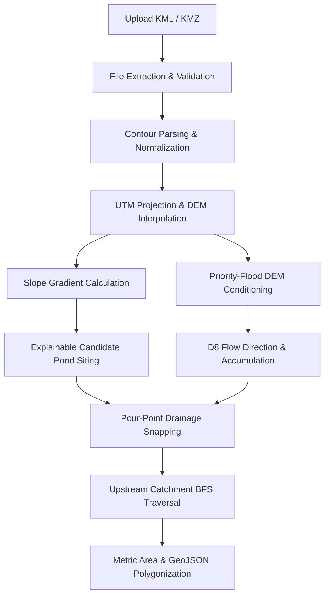

# AI-Based Village Pond Planning System (Assignment 2 — End-to-End Pond Planning)

A modular FastAPI backend **plus lightweight map frontend** for the AI-based Village Pond Planning System. The user selects a land area on an interactive map; the backend automatically acquires a DEM from public elevation sources, reconstructs terrain and contours, sites a pond candidate inside the selected land using explainable terrain/hydrology criteria, delineates the upstream catchment (which may extend beyond the selected land), obtains historical rainfall, and estimates theoretical runoff, expected collectible water, and indicative pond storage — all returned as structured GeoJSON/JSON ready for map visualization.

The original KML/KMZ contour-upload workflow (`/findCatchment`) is fully preserved as a fallback and for expert/testing use.

---

## Deployment Status & Live Service

[](https://pond-catchment-backend.onrender.com/docs)
[](https://pond-catchment-backend.onrender.com/docs)
[](https://pond-catchment-backend.onrender.com/docs)

The backend service is actively deployed and hosted live on **Render**:

| Resource | Live URL | Status | Description |
| :--- | :--- | :--- | :--- |
| **Interactive API Docs (Swagger UI)** | [https://pond-catchment-backend.onrender.com/docs](https://pond-catchment-backend.onrender.com/docs) | `200 OK` | Interactive testing of all endpoints |
| **Alternative Docs (ReDoc)** | [https://pond-catchment-backend.onrender.com/redoc](https://pond-catchment-backend.onrender.com/redoc) | `200 OK` | Schema & OpenAPI specification |
| **Root Service Status** | [https://pond-catchment-backend.onrender.com/](https://pond-catchment-backend.onrender.com/) | `200 OK` | Service metadata and version |
| **Health Check Endpoint** | [https://pond-catchment-backend.onrender.com/api/v1/health](https://pond-catchment-backend.onrender.com/api/v1/health) | `200 OK` | System liveness probe |
| **Catchment Analysis Endpoint** | `POST https://pond-catchment-backend.onrender.com/api/v1/findCatchment` | `Active` | Production terrain & catchment pipeline |

---

## Architecture & Modular Structure

The backend follows clean architectural principles where the API route layer orchestrates dedicated, single-responsibility services. Every result is derived dynamically from input files without hard-coded coordinates, elevation values, bounds, or areas.

```text
pond_catchment_backend/
├── app/
│   ├── api/
│   │   └── v1/
│   │   ├── endpoints/
│   │   │   ├── health.py             # System liveness and health check endpoint
│   │   │   ├── catchment.py          # Route orchestrator for /findCatchment & /analyzeContour (KML fallback)
│   │   │   ├── land.py               # Route orchestrator for /analyzeLand (land selection)
│   │   │   ├── terrain.py            # Route orchestrator for /terrainPreview (DEM acquisition preview)
│   │   │   └── pond_site.py          # Route orchestrator for /analyzePondSite (unified workflow)
│   │   └── api.py                    # V1 API router aggregator
│   ├── core/
│   │   └── config.py                     # Environment-driven settings (pydantic-settings)
│   ├── models/                           # Domain models & database entity schemas
│   ├── schemas/
│   │   ├── health.py                     # Health check schemas
│   │   ├── catchment.py                  # Pydantic schemas: Contours, DEM, Candidates, Catchment, GeoJSON
│   │   ├── land.py                       # Pydantic schemas: GeoJSON land selection, area, bbox, centroid
│   │   ├── terrain.py                    # Pydantic schemas: terrain preview / DEM acquisition
│   │   ├── rainfall.py                   # Pydantic schemas: rainfall statistics
│   │   ├── water.py                      # Pydantic schemas: runoff / collectible water
│   │   ├── pond.py                       # Pydantic schemas: indicative pond storage
│   │   └── pond_site.py                  # Pydantic schemas: unified analysis request/response
│   ├── services/
│   │   ├── parser.py                     # KML/KMZ unpacking, XML parsing, & contour normalization
│   │   ├── terrain.py                    # UTM projection, DEM interpolation, slope, DEM->TerrainModel, land mask
│   │   ├── candidate_selection.py        # Explainable multi-factor candidate pond siting & ranking
│   │   ├── hydrology.py                  # Priority-Flood sink filling, D8 flow, snapping, & catchment delineation
│   │   ├── land.py                       # GeoJSON land-area validation & geodesic area measurement
│   │   ├── dem.py                        # Automatic DEM acquisition (AWS Terrain Tiles / OpenTopography) + caching
│   │   ├── contours.py                   # DEM -> contour lines (marching squares) as GeoJSON
│   │   ├── rainfall.py                   # Historical rainfall (Open-Meteo, NASA POWER fallback) + caching
│   │   ├── water.py                      # Transparent runoff / expected collectible water estimation
│   │   ├── pond.py                       # Indicative pond storage sizing (separate from runoff)
│   │   └── pond_planning.py              # Unified pipeline orchestration (Phase 8)
│   ├── static/                           # Frontend (Leaflet map, no build step)
│   │   ├── index.html                    # Map, drawing tools, results panel
│   │   ├── app.js                        # Map interactions + API calls (no calculations)
│   │   └── style.css
│   ├── utils/
│   │   └── file_handler.py               # File extension & archive validation utilities
│   └── main.py                           # FastAPI application entry point, CORS, routers, /app static mount
├── data/
│   ├── cache/                            # DEM + rainfall disk caches (gitignored)
│   └── sample/                           # Sample contour datasets
│       └── contours_1m.kml               # 1,355 contour lines (1m interval, 267m - 298m elevation)
├── tests/
│   ├── conftest.py                       # Pytest fixtures and TestClient configuration
│   ├── test_catchment.py                 # Contour pipeline unit & end-to-end test suite
│   ├── test_land.py                      # Land selection validation & measurement test suite
│   ├── test_dem.py                       # DEM acquisition, caching & validation test suite
│   ├── test_contours.py                  # Contour generation & DEM terrain integration tests
│   ├── test_pond_siting.py               # Land-constrained candidates + catchment tests
│   ├── test_rainfall.py                  # Rainfall parsing/fallback/caching tests
│   ├── test_water.py                     # Runoff + storage estimation tests
│   ├── test_pond_site.py                 # Unified /analyzePondSite end-to-end tests
│   ├── test_limits_and_frontend.py       # Request-size guards + static frontend tests
│   └── test_health.py                    # Health & status test suite
├── .env.example                          # Environment configuration template
├── .gitignore                            # Git exclusions for Python, venv, caches, logs
├── README.md                             # Comprehensive technical documentation
└── requirements.txt                      # Production dependencies
```

---

## Setup & Installation

### 1. Prerequisites
- Python 3.10+ (tested on Python 3.12.3)
- PowerShell (Windows) or Bash (macOS/Linux)

### 2. Environment Activation
Activate the existing virtual environment:

**Windows (PowerShell):**
```powershell
.\venv\Scripts\Activate.ps1
```

**macOS / Linux:**
```bash
source venv/bin/activate
```

### 3. Install Dependencies
```powershell
pip install -r requirements.txt
```

### 4. Configuration
Copy the environment template:
```powershell
cp .env.example .env
```

---

## Running the Application

Start the development server with Uvicorn:

```powershell
uvicorn app.main:app --reload --host 0.0.0.0 --port 8000
```

Live Service & API Documentation:
- **Interactive Swagger Documentation**: [https://pond-catchment-backend.onrender.com/docs](https://pond-catchment-backend.onrender.com/docs)
- **ReDoc Documentation**: [https://pond-catchment-backend.onrender.com/redoc](https://pond-catchment-backend.onrender.com/redoc)
- **Root Service Status**: [https://pond-catchment-backend.onrender.com/](https://pond-catchment-backend.onrender.com/)
- **Health Check**: [https://pond-catchment-backend.onrender.com/api/v1/health](https://pond-catchment-backend.onrender.com/api/v1/health)

---

## API Specification

### Endpoints

| Method | Path | Summary | Description |
| :--- | :--- | :--- | :--- |
| `GET` | `/` | Root Information | Returns backend service status and API version |
| `GET` | `/api/v1/health` | Health Check | System liveness probe |
| `POST` | `/api/v1/findCatchment` | Find Catchment & Siting | Upload contour map, analyze terrain, site pond, & delineate upstream catchment |
| `POST` | `/api/v1/analyzeContour` | Analyze Contour (Alias) | Identical alias for `/findCatchment` |
| `POST` | `/api/v1/analyzeLand` | Analyze Land Selection | Validate a user-selected land polygon (GeoJSON) and return area, bounding box, & centroid |
| `POST` | `/api/v1/terrainPreview` | Terrain Preview (Auto DEM) | Acquire a DEM for the buffered analysis extent around a selected land polygon |
| `POST` | `/api/v1/analyzePondSite` | **Unified Pond-Site Analysis** | Full workflow: land → DEM → terrain/contours → pond candidate → catchment → rainfall → water volume → storage |
| `GET` | `/app/` | Frontend | Interactive map application (draw land, analyze, view overlays) |

### Request Format
- **`/findCatchment` & `/analyzeContour`**: `multipart/form-data`, parameter `file` (Binary file, extension `.kml` or `.kmz`)
- **`/analyzeLand` & `/terrainPreview`**: `application/json` with a `geometry` field containing a GeoJSON `Polygon` or `MultiPolygon`
- **`/analyzePondSite`**: `multipart/form-data` with `request` (JSON string: `{"geometry": {...}, "analysis_parameters": {...}}`) and optionally `file` (KML/KMZ expert path)

### Land Area Selection (`POST /api/v1/analyzeLand`)

The first step of the pond-planning workflow. The user selects a land area on an interactive map; the frontend sends the selection as GeoJSON. The backend validates the geometry (closed rings, non-zero area, reasonable coordinate ranges and extent) and returns its metrics. This polygon becomes the spatial constraint for all subsequent terrain and hydrology analysis.

**Request:**
```json
{
    "geometry": {
        "type": "Polygon",
        "coordinates": [
            [[81.290, 21.245], [81.296, 21.245], [81.296, 21.250], [81.290, 21.250], [81.290, 21.245]]
        ]
    }
}
```

**Response (`200 OK`):**
```json
{
  "status": "success",
  "selected_land": {
    "geometry": { "type": "Polygon", "coordinates": [...] },
    "geometry_type": "Polygon",
    "area_m2": 344776.38,
    "area_hectares": 34.4776,
    "bounding_box": {
      "min_latitude": 21.245,
      "max_latitude": 21.25,
      "min_longitude": 81.29,
      "max_longitude": 81.296
    },
    "centroid": { "latitude": 21.2475, "longitude": 81.293 }
  },
  "message": "Selected land area successfully validated and measured. This polygon constrains all subsequent terrain and hydrology analysis."
}
```

**Validation & Assumptions:**
- Area is computed as the **geodesic polygon area on the WGS84 ellipsoid** (`pyproj.Geod`) — projection-independent and accurate at village scale. Holes are subtracted; overlapping MultiPolygon parts are merged so shared area is never double-counted.
- The centroid is the planar (shapely) centroid in WGS84 degrees — adequate for village-scale selections.
- Rejected with `400 Bad Request`: unclosed rings, fewer than 4 positions, degenerate/collinear rings, self-intersecting polygons, out-of-range coordinates, selections crossing the antimeridian, and areas outside `[1 m², MAX_LAND_AREA_SQ_KM]` (default 100 km², configurable via the `MAX_LAND_AREA_SQ_KM` environment variable). Non-Polygon GeoJSON types are rejected with `422`.

### Automatic DEM Acquisition (`POST /api/v1/terrainPreview`)

For the normal user workflow, no KML upload is required: the backend acquires elevation data automatically for the area around the selected land. The KML/KMZ contour workflow (`/findCatchment`) remains fully supported as a fallback and for expert/manual use.

**Concept — construction area vs. hydrological extent:** the selected land polygon is the pond *construction* constraint, while the catchment feeding a candidate pond may extend well outside it. The DEM is therefore acquired for an **analysis extent** = land bounding box + a uniform buffer (`ANALYSIS_BUFFER_METERS`, default 500 m) on every side, so upstream terrain is included in subsequent flow analysis.

**Provider evaluation and decision:**

| Criterion | AWS Terrain Tiles (default) | OpenTopography API (optional) |
| :--- | :--- | :--- |
| Coverage | Global | Global |
| API key | **Not required** (public AWS Open Data bucket) | Free key required |
| Rate limits | None documented for reasonable use | ~50 calls/24 h (non-academic) |
| Format | Terrarium PNG tiles (z/x/y, zoom 0–15) | AAIGrid plain text (no GDAL needed) |
| Effective resolution | ~10–30 m (SRTM/GMTED2010-derived) | 30 m (SRTMGL1) |
| Reliability | AWS Open Data registry dataset | Established academic service |
| Latency | Fast S3 delivery per tile (~1 s) | Slower server-side clipping |

AWS Terrain Tiles is the default because it needs no registration and has no tight rate limits; OpenTopography can be enabled by setting `OPEN_TOPOGRAPHY_API_KEY` and is used automatically as a fallback provider when the primary fails.

**Processing pipeline:** land bbox → buffered analysis extent → UTM grid construction (reusing the existing dynamic UTM zone logic) → tile fetch / AAIGrid fetch → bilinear resampling of the native raster onto the UTM grid at the target resolution (`DEM_TARGET_RESOLUTION_M`, default 30 m) → NoData nearest-neighbour fill → elevation plausibility validation (`-500 m` to `9000 m`).

**Caching:** results are cached in memory (LRU, 4 entries) and on disk (`DEM_CACHE_DIR`, default `data/cache/dem`, compressed NPZ + JSON metadata). The cache key is a SHA-256 hash of provider, dataset, geographic extent (6-decimal precision) and resolution — identical areas are never re-downloaded. Elevation data does not change over time, so cache entries have no expiry.

**Safeguards:** analysis extent ≤ `DEM_MAX_EXTENT_KM` (default 15 km), ≤ `DEM_MAX_TILES` per request (auto-coarsens zoom), grid dimension ≤ `DEM_MAX_GRID_DIM` (auto-coarsens resolution, mirroring the contour pipeline), per-request timeouts (`DEM_REQUEST_TIMEOUT_S`), response-size caps, and graceful `502`/`422` errors when providers are unreachable or the area has insufficient elevation data (polar regions outside Web Mercator coverage are rejected).

**Attribution:** Terrain tiles: Mapzen/AWS Open Data. Global SRTM data courtesy of the U.S. Geological Survey; GMTED2010 courtesy of USGS; ETOPO1 courtesy of NOAA; regional sources per Mapzen attribution requirements.

**Example request** (same body as `/analyzeLand`):
```json
{
    "geometry": {
        "type": "Polygon",
        "coordinates": [
            [[81.290, 21.245], [81.296, 21.245], [81.296, 21.250], [81.290, 21.250], [81.290, 21.245]]
        ]
    },
    "buffer_meters": 500,
    "resolution_meters": 30
}
```

**Example response (`200 OK`, abridged):**
```json
{
  "status": "success",
  "analysis_extent": { "min_latitude": 21.2399, "max_latitude": 21.2551, "min_longitude": 81.2847, "max_longitude": 81.3013 },
  "buffer_meters": 500.0,
  "target_resolution_meters": 30.0,
  "dem": {
    "crs": "EPSG:32644",
    "resolution_meters": 30.0,
    "rows": 52,
    "cols": 55,
    "min_elevation_m": 266.44,
    "max_elevation_m": 292.76,
    "mean_elevation_m": 280.8,
    "nodata_cells_filled": 0,
    "source": {
      "provider": "aws_terrain_tiles",
      "dataset": "terrarium",
      "zoom_level": 13,
      "attribution": "Terrain tiles: Mapzen/AWS Open Data. ..."
    },
    "cache_hit": false
  }
}
```

### Unified Analysis (`POST /api/v1/analyzePondSite`)

The complete end-to-end workflow. **Normal usage requires no file upload** — only the selected land GeoJSON; terrain is acquired automatically through the DEM service. A KML/KMZ contour file may be supplied instead for expert/testing use (backwards compatibility).

**Workflow:** selected land → analysis extent (land bbox + buffer) → DEM acquisition (cached) → terrain & slope → contours (GeoJSON) → hydrology conditioning + D8 flow + accumulation (computed once, shared) → pond candidates (constrained to the selected land, flow-weighted scoring) → catchment delineation (not clipped to the land) → rainfall (cached) → theoretical runoff → expected collectible water → indicative pond storage.

**Request** (multipart form field `request`):
```json
{
    "geometry": {
        "type": "Polygon",
        "coordinates": [
            [[81.290, 21.245], [81.296, 21.245], [81.296, 21.250], [81.290, 21.250], [81.290, 21.245]]
        ]
    },
    "analysis_parameters": {
        "buffer_meters": 500,
        "contour_interval_m": 5,
        "runoff_coefficient": 0.35,
        "collection_efficiency": 0.75
    }
}
```

**Response structure (`200 OK`, abridged):**
```json
{
  "status": "success",
  "selected_land": { "area_m2": 344776.38, "area_hectares": 34.4776, "geometry": { "...": "GeoJSON Polygon" } },
  "terrain": { "crs": "EPSG:32644", "grid_resolution_meters": 30.0, "rows": 52, "cols": 55, "slope": { "mean_slope_degrees": 1.85 } },
  "contours": { "type": "FeatureCollection", "features": [ { "geometry": { "type": "LineString" }, "properties": { "elevation_m": 275.0 } } ] },
  "pond": { "latitude": 21.2469, "longitude": 81.2899, "elevation": 269.4, "slope_degrees": 2.4, "suitability_score": 0.83, "factor_scores": { "slope_score": 1.0, "elevation_score": 0.9, "flow_score": 0.6 } },
  "catchment": { "catchment_area_m2": 145000.0, "catchment_area_hectares": 14.5, "contributing_cells_count": 161, "boundary": { "type": "Feature", "geometry": { "type": "Polygon" } } },
  "rainfall": { "rainfall_mm": 1213.4, "period": "2015-2024", "source": "open-meteo", "dataset": "ERA5 / ERA5-Land reanalysis" },
  "water": {
    "runoff_coefficient": 0.35,
    "runoff_coefficient_basis": "Explicitly provided in the analysis parameters.",
    "theoretical_runoff_m3": 61540.1,
    "collection_efficiency": 0.75,
    "expected_collectible_water_m3": 46155.1
  },
  "pond_storage": { "storage_capacity_m3": 46155.1, "depth_m": 3.0, "top_length_m": 190.3, "top_width_m": 132.9, "note": "Indicative conceptual sizing …" },
  "dem_source": { "provider": "aws_terrain_tiles", "dataset": "terrarium", "zoom_level": 13 },
  "message": "Terrain acquired automatically for the buffered analysis extent around the selected land. ..."
}
```

> The values above are illustrative; every value is derived dynamically from the input geometry and acquired data — nothing is hard-coded.

**Frontend (`GET /app/`):** a no-build Leaflet application served by the same backend. The user draws the land polygon on an interactive map (OSM or Esri satellite basemaps), submits it, sees loading/progress and error states, and the response overlays the selected land (blue), catchment boundary (green dashed), pond marker (red), and DEM contours (grey, toggleable). The frontend performs **no calculations** — all terrain, hydrology, rainfall, and water computations happen in the backend.

---

## Processing Methodology

The end-to-end workflow executed by `POST /findCatchment` follows sequential modular stages:


```mermaid
flowchart TD
    A[Upload KML / KMZ] --> B[File Extraction & Validation]
    B --> C[Contour Parsing & Normalization]
    C --> D[UTM Projection & DEM Interpolation]
    D --> E[Slope Gradient Calculation]
    E --> F[Explainable Candidate Pond Siting]
    D --> G[Priority-Flood DEM Conditioning]
    G --> H[D8 Flow Direction & Accumulation]
    F --> I[Pour-Point Drainage Snapping]
    H --> I
    I --> J[Upstream Catchment BFS Traversal]
    J --> K[Metric Area & GeoJSON Polygonization]
```

1. **File Extraction & Validation (`app/utils/file_handler.py`, `app/services/parser.py`)**:
   - Validates file extensions (`.kml`, `.kmz`).
   - Safely unzips KMZ archives in temporary directories to discover nested `.kml` payload files without assuming hard-coded paths.
   - Enforces checks against empty files, corrupted archives, and invalid XML.

2. **Contour Extraction & Normalization (`ContourParserService.parse_and_normalize_kml`)**:
   - Extracts coordinates from `LineString`, `Polygon`, or `MultiGeometry` elements.
   - Discovers elevation values across multiple standard KML attributes: `SimpleData` / `Data` tags (`ELEVATION`, `contour`, `z`), Placemark `<name>`, `<description>`, or 3D coordinate triples.
   - Discards degenerate single-point lines and validates that at least two distinct elevation levels exist.

3. **Continuous Terrain Interpolation (`TerrainService.reconstruct_terrain`)**:
   - Computes the center longitude/latitude to dynamically project coordinates into the appropriate Universal Transverse Mercator (UTM) zone (e.g. `EPSG:32644` for Central India).
   - Generates a regular 2D metric grid (default resolution: $10\text{ m}$) across the bounding box.
   - Dynamically adapts grid resolution if the input extent exceeds 500 cells in any dimension to guard against memory exhaustion.
   - Interpolates elevations using Delaunay triangulation / linear barycentric interpolation (`scipy.interpolate.griddata`) with nearest-neighbor extrapolation along boundary edges.

4. **Terrain Slope Modeling (`TerrainService.calculate_slope`)**:
   - Calculates 2D spatial gradients ($\partial Z / \partial x$, $\partial Z / \partial y$) using central finite differences.
   - Computes surface slope in degrees: $\theta = \arctan(\sqrt{(\partial Z / \partial x)^2 + (\partial Z / \partial y)^2}) \times \frac{180}{\pi}$.

5. **Explainable Candidate Pond Siting (`CandidateSelectionService.identify_candidates`)**:
   - Evaluates terrain cells using a multi-criteria scoring model with configurable weights (`slope_weight = 0.5`, `elevation_weight = 0.5`):
     - **Slope Suitability ($S_{\text{slope}}$)**: Ideal $\le 3^\circ$, linear penalty up to $12^\circ$.
     - **Elevation Suitability ($S_{\text{elevation}}$)**: Relative position in local depression/valley.
     - **Optional Flow Suitability ($S_{\text{flow}}$)**: Ingests flow accumulation if enabled.
   - Retains granular factor scores for transparent auditing.
   - Applies spatial Non-Maximum Suppression (NMS) with a minimum distance threshold ($150\text{ m}$) and boundary buffering to guarantee candidate sites represent distinct, physically separated village pond regions.

6. **Hydrological Drainage & Catchment Delineation (`HydrologyService.analyze_hydrology`)**:
   - **DEM Conditioning (`condition_dem`)**: Applies Priority-Flood depression filling using a priority queue (`heapq`) to eliminate artificial pits and ensure monotonic drainage towards the raster edges.
   - **D8 Flow Direction (`calculate_flow_direction`)**: Evaluates steepest downward descent drop across all 8 cardinal and diagonal neighbors with distance normalization ($\Delta z / d$).
   - **Flow Accumulation (`calculate_flow_accumulation`)**: Computes upstream contributing area matrix via topological sorting by descending elevation.
   - **Pour-Point Snapping (`snap_to_drainage_cell`)**: Snaps the selected candidate pond coordinate to the local stream channel (highest flow accumulation cell within a $100\text{ m}$ radius) with distance tie-breaking.
   - **Catchment Delineation (`delineate_catchment`)**: Reconstructs upstream contributing terrain using Breadth-First Search (BFS) reverse flow graph traversal from the snapped outlet.
   - **Metric Area & Polygonization (`polygonize_catchment`)**: Aggregates contributing cells into metric polygons using Shapely `box`, unions them via `unary_union`, transforms the boundary back to WGS84 `(longitude, latitude)`, and exports as a standard GeoJSON Feature polygon.
   - **Area Calculation**: Area is accurately computed in projected metric units:
     $$\text{Area } (m^2) = N_{\text{cells}} \times \text{resolution}^2, \quad \text{Area } (\text{ha}) = \frac{\text{Area } (m^2)}{10,000}$$

The unified `/analyzePondSite` workflow (automatic DEM path) adds the following stages on top of the shared terrain/hydrology core:

7. **Contour Generation from DEM (`ContourGenerationService.generate_contours`)**:
   - Vectorized marching squares over the elevation grid at a configurable interval (default 5 m; minimum 1 m — finer intervals are rejected because they would imply precision the DEM cannot support).
   - Segments are chained into LineStrings (closed rings stay closed) and converted to WGS84 GeoJSON `FeatureCollection` for direct frontend rendering.
   - Level count is capped at 50; the interval coarsens automatically for very high-relief areas.

8. **Land-Constrained Candidate Siting (DEM path)**:
   - The selected land polygon is rasterized onto the terrain grid (`TerrainService.mask_cells_within_polygon`, cell-center containment via `shapely.contains_xy`).
   - Candidates are chosen **only** from masked cells; the catchment feeding them is **not** clipped to the land.
   - The DEM path uses the documented flow-weighted scoring profile: `slope_weight = 0.35`, `elevation_weight = 0.15`, `flow_weight = 0.50` — preferring locations with meaningful upstream flow convergence over simply the lowest elevation. Weights are returned in the response (`scoring_config`) for transparency.

9. **Historical Rainfall (`RainfallService.get_rainfall`)**:
   - Primary: **Open-Meteo Historical Weather API** (ERA5/ERA5-Land, ~9–11 km grid) — free, no API key, daily precipitation for the last 10 complete years → mean annual depth + monthly climatology.
   - Fallback: **NASA POWER agroclimatology** (`PRECTOTCORR`, ~0.5° grid) — annual mean daily precipitation × 365.25.
   - Both providers are free and key-less; identical requests are cached in memory and on disk (`data/cache/rainfall/`) with coordinates rounded to 2 decimals (~1.1 km).

10. **Water Volume (`WaterVolumeService.estimate`) and Indicative Storage (`PondStorageService.suggest_pond_storage`)**:
    - Theoretical runoff: $\text{Runoff (m}^3\text{)} = \text{Catchment Area (m}^2\text{)} \times \dfrac{\text{Rainfall (mm)}}{1000} \times C_{\text{runoff}}$
    - Expected collectible water: $\text{Collectible} = \text{Runoff} \times \eta_{\text{collection}}$
    - Defaults (documented, overridable per request): $C_{\text{runoff}} = 0.30$ (mid-range of the 0.2–0.5 typical values for small rural catchments, USDA SCS / FAO guidance) and $\eta_{\text{collection}} = 0.75$ (allowance for conveyance, seepage and evaporation losses). Theoretical runoff and collectible water are reported **separately**.
    - Indicative storage sizes a truncated-pyramid basin ($V = d\,(A_{bottom}+A_{top})/2$, side slope 2H:1V, depth 3 m) whose capacity matches the collectible inflow. It is clearly labeled as conceptual sizing, **not** engineering design, and is kept strictly separate from runoff volume.

---

## Example API Response (`200 OK`)

```json
{
  "filename": "contours_1m.kml",
  "file_type": "kml",
  "file_size_bytes": 6710528,
  "is_valid": true,
  "can_parse": true,
  "contours_processed": 1355,
  "min_elevation": 267.0,
  "max_elevation": 298.0,
  "extent": {
    "min_latitude": 21.2398224,
    "max_latitude": 21.2635806,
    "min_longitude": 81.2814045,
    "max_longitude": 81.3126469
  },
  "terrain": {
    "crs": "EPSG:32644",
    "grid_resolution_meters": 10.0,
    "rows": 264,
    "cols": 326,
    "min_elevation": 267.0,
    "max_elevation": 298.0,
    "projected_bounds": {
      "min_x": 529194.47,
      "max_x": 532436.11,
      "min_y": 2348720.29,
      "max_y": 2351345.67
    },
    "geographic_extent": {
      "min_latitude": 21.2398224,
      "max_latitude": 21.2635806,
      "min_longitude": 81.2814045,
      "max_longitude": 81.3126469
    },
    "slope": {
      "min_slope_degrees": 0.0,
      "max_slope_degrees": 32.14,
      "mean_slope_degrees": 3.3
    }
  },
  "candidate_sites": [
    {
      "id": "pond_site_1",
      "rank": 1,
      "latitude": 21.2497874,
      "longitude": 81.2899562,
      "elevation": 267.0,
      "slope_degrees": 2.8,
      "suitability_score": 1.0,
      "factor_scores": {
        "slope_score": 1.0,
        "elevation_score": 1.0
      }
    }
  ],
  "selected_pond": {
    "id": "pond_site_1",
    "rank": 1,
    "latitude": 21.2497874,
    "longitude": 81.2899562,
    "elevation": 267.0,
    "slope_degrees": 2.8,
    "suitability_score": 1.0,
    "factor_scores": {
      "slope_score": 1.0,
      "elevation_score": 1.0
    }
  },
  "catchment": {
    "outlet_location": {
      "latitude": 21.2497874,
      "longitude": 81.2899562,
      "elevation": 267.0
    },
    "snapped_outlet": {
      "latitude": 21.2496987,
      "longitude": 81.2889922,
      "elevation": 273.86
    },
    "elevation_meters": 273.86,
    "slope_degrees": 4.66,
    "catchment_area_sq_meters": 14500.0,
    "catchment_area_hectares": 1.45,
    "contributing_cells_count": 145,
    "hydrology": {
      "max_flow_accumulation_cells": 173.0,
      "outlet_flow_accumulation_cells": 145.0,
      "conditioned_sinks_filled": true
    },
    "boundary": {
      "type": "Feature",
      "geometry": {
        "type": "Polygon",
        "coordinates": [
          [
            [81.288028, 21.249700],
            [81.288028, 21.249791],
            [81.288029, 21.250062],
            [81.289089, 21.249969],
            [81.288028, 21.249700]
          ]
        ]
      },
      "properties": {
        "contributing_cells": 145,
        "crs": "EPSG:32644"
      }
    }
  },
  "message": "Contour file successfully validated, normalized, reconstructed, and analyzed for pond catchment."
}
```

---

## Assumptions & Limitations

1. **Surface Topography Only**: Hydrological modeling assumes overland gravity-driven surface runoff based solely on the reconstructed elevation model. It does not account for sub-surface infiltration, groundwater tables, evaporation rates, or subterranean pipe networks.
2. **Artificial Obstructions**: Existing man-made culverts, road bridges, ditches, or embankments not captured in the elevation data are not represented in the raster surface.
3. **DEM Resolution & Pond-Site Precision**: The automatic DEM path uses ~30 m resolution global data (AWS Terrain Tiles, resampled to `DEM_TARGET_RESOLUTION_M`). Pond-site precision is therefore limited to roughly one grid cell (~30 m), and derived elevations/slopes are planning-level approximations. Contour intervals below 1 m are refused to avoid implying unsupported precision.
4. **Rainfall Data**: Rainfall comes from reanalysis/climatology products (ERA5 via Open-Meteo, ~9–11 km; NASA POWER, ~0.5°) — gridded estimates, not gauge measurements. Annual means smooth year-to-year variability and do not capture extreme-event dynamics.
5. **Runoff Coefficient & Collection Efficiency**: The defaults (0.30 and 0.75) are documented planning assumptions within published typical ranges; they are not measured values for any specific catchment and can be overridden per request.
6. **Storage Sizing Is Conceptual**: The pond-storage module produces an indicative basin geometry from an average-end-area frustum model with no freeboard, lining, or inlet/outlet structures. It is **not** a certified engineering design.
7. **Linear DEM Interpolation** (KML path): Interpolation between contour lines utilizes linear barycentric interpolation over Delaunay triangles, which represents natural terrain well but may smooth sharp breaklines or micro-topographic features.
8. **Preliminary Nature**: This system is designed for macro-level preliminary siting and planning.

## Environment Variables

| Variable | Default | Purpose |
| :--- | :--- | :--- |
| `MAX_LAND_AREA_SQ_KM` | `100` | Maximum accepted selected-land area |
| `DEM_PROVIDER` | `aws_terrain_tiles` | Primary DEM provider (`aws_terrain_tiles` or `opentopography`) |
| `OPEN_TOPOGRAPHY_API_KEY` | *(empty)* | Enables the OpenTopography provider (free key) |
| `OPEN_TOPOGRAPHY_DATASET` | `SRTMGL1` | OpenTopography `demtype` |
| `ANALYSIS_BUFFER_METERS` | `500` | Buffer around the land bbox defining the analysis extent |
| `DEM_TARGET_RESOLUTION_M` | `30` | Target DEM grid resolution |
| `DEM_REQUEST_TIMEOUT_S` | `45` | External DEM request timeout |
| `DEM_CACHE_DIR` | `data/cache/dem` | DEM disk cache directory |
| `DEM_MAX_TILES` | `64` | Maximum tiles per acquisition (auto-coarsens zoom) |
| `DEM_MAX_GRID_DIM` | `500` | Maximum grid dimension (auto-coarsens resolution) |
| `DEM_MAX_EXTENT_KM` | `15` | Maximum analysis-extent size |
| `RAINFALL_YEARS_WINDOW` | `10` | Historical window length for rainfall statistics |
| `RAINFALL_REQUEST_TIMEOUT_S` | `30` | External rainfall request timeout |
| `RAINFALL_CACHE_DIR` | `data/cache/rainfall` | Rainfall disk cache directory |
| `MAX_UPLOAD_SIZE_MB` | `20` | KML/KMZ upload size limit |
| `MAX_LAND_VERTICES` | `2000` | Maximum vertices per land polygon |
| `REDIS_URL` | *(empty)* | Shared Redis L2 cache for the distributed deployment (e.g. `redis://<proxy-node>:6379/1`); empty = local caches only |
| `NODE_ID` | *(hostname)* | Node identifier exposed in logs, `X-Served-By`, `/ready` and `/version` |
| `APP_ENV` | `production` | Deployment environment label |
| `GIT_COMMIT` | *(empty)* | Build metadata exposed via `/api/v1/version` |
| `DEM_CACHE_TTL_S` | `2592000` | Shared-cache TTL for DEM entries |
| `RAINFALL_CACHE_TTL_S` | `604800` | Shared-cache TTL for rainfall entries |
| `LOG_LEVEL` | `INFO` | Logging verbosity |

## Distributed Deployment

The system runs horizontally scaled across four API servers behind an Nginx load balancer (`Client → Nginx :3309 → 4 × FastAPI :8000 → shared Redis → external DEM/rainfall providers`). See [DEPLOYMENT.md](DEPLOYMENT.md) for the topology, the L1/L2/L3 cache design, health/readiness/version endpoints, failure-handling behavior, and the one-command deployment/update procedure (`python deploy/deploy_all.py push | nginx | verify`).

---

## Important Engineering Disclaimer

> [!WARNING]
> **Preliminary Planning Tool Only**: The results provided by this system—including candidate pond locations, suitability scores, and estimated catchment areas—are preliminary terrain-based planning estimates. They are **NOT** a substitute for certified field land surveys, geotechnical soil borings, hydraulic engineering designs, or official legal land-ownership verification. Detailed ground-truthing and formal engineering studies are required prior to any construction or excavation.

---

## Verification & Testing

The repository contains automated unit and integration tests covering the complete pipeline:

```powershell
pytest tests/ -v
```

### Key Test Categories
- **File Ingestion & Archive Extraction**: Valid KML, valid KMZ archives, malformed archives, missing uploads, unsupported file formats (`.txt`, `.shp`).
- **Contour Normalization**: KML `<ExtendedData>`, `<SchemaData>`, 3D coordinate triples, description parsing, missing elevations, degenerate lines.
- **Dynamic Terrain Modeling**: Dynamic spatial bound resolution, grid resolution scaling, slope angle accuracy against analytical test planes.
- **Multi-Factor Candidate Siting**: Weight sensitivity testing, spatial non-maximum suppression (NMS) verification.
- **Hydrological D8 Analysis**: Priority-Flood pit filling, flow direction downhill routing, flow accumulation monotonicity, drainage snapping with distance tie-breaking.
- **Dynamic Input Variance**: Proves that varying input contour terrain produces strictly different candidate locations, snapped outlets, and catchment boundaries.
- **End-to-End Integration**: Validates end-to-end execution against the sample dataset `data/sample/contours_1m.kml`.
- **Land Selection**: Valid polygons/MultiPolygons/holes/3D positions and every validation failure mode (unclosed rings, zero area, antimeridian, oversize).
- **DEM Acquisition**: Provider selection & fallback, deterministic caching (memory + disk), NoData handling, extent/grid safeguards, zoom selection, AAIGrid parsing, bilinear sampling, plus an opt-in live network test (`RUN_LIVE_DEM_TESTS=1`).
- **Contour Generation**: Marching-squares levels, closed rings on synthetic cones, interval caps, DEM→TerrainModel bridge.
- **Land-Constrained Siting & Catchment**: Candidates always inside the selected land; catchment demonstrably extends beyond it; precomputed-grid equivalence with the legacy path.
- **Rainfall**: Response parsing (Open-Meteo & NASA POWER), provider fallback, caching, coordinate rounding, failure handling.
- **Water & Storage**: Unit conversion, explicit coefficient handling, efficiency separation, capacity ≈ inflow sizing, invalid-input rejection.
- **Unified API**: Full JSON workflow, KML fallback path, explicit-parameter override, terrain-source exclusivity, sub-cell selection rejection.
- **Limits & Frontend**: Upload-size and vertex-count guards; static frontend serving (`/app/`).

---

## Demonstration

### End-to-end workflow (automatic DEM path — no file upload)

```bash
curl -X POST "https://pond-catchment-backend.onrender.com/api/v1/analyzePondSite" \
  -F 'request={"geometry": {"type": "Polygon", "coordinates": [[[81.290, 21.245], [81.296, 21.245], [81.296, 21.250], [81.290, 21.250], [81.290, 21.245]]]}}'
```

The response contains the selected-land metrics, acquired DEM source, terrain/contour GeoJSON, the pond candidate, the catchment polygon, rainfall statistics, runoff/collectible-water figures, and indicative pond storage. Repeat calls for the same area are served from cache (`cache_hit: true`).

### Frontend walkthrough

1. Open `/app/` on the deployed service (or `http://localhost:8000/app/` locally).
2. Choose a basemap (OpenStreetMap or Esri satellite).
3. Click **Draw polygon** and click (or double-click) vertices around the village land; press **Finish** to close (minimum 3 vertices).
4. Click **Analyze selected area** — the loading state shows while the backend acquires the DEM, runs hydrology, fetches rainfall, and computes water volumes.
5. The map overlays the selected land (blue), catchment boundary (green dashed), pond marker (red), and DEM contours (grey, toggleable); the results panel shows all metrics with sources and assumptions.

### KML/KMZ fallback (backward compatibility)

```bash
curl -X POST "https://pond-catchment-backend.onrender.com/api/v1/findCatchment" \
  -F "file=@data/sample/contours_1m.kml"
```

---

## Deployment on Render (render.com)

The repository is configured for automated deployment on [Render](https://render.com) as a Web Service.

### Option A: 1-Click Deployment via Blueprint (Recommended)

1. Push your repository to GitHub.
2. Log in to [Render Dashboard](https://dashboard.render.com).
3. Click **New +** -> **Blueprint**.
4. Connect your GitHub repository.
5. Render detects [render.yaml](file:///c:/CodingNest/pond_catchment_backend/render.yaml) and automatically configures:
   - **Service Name**: `pond-catchment-backend`
   - **Environment**: `Python` (`3.12.3` via [.python-version](file:///c:/CodingNest/pond_catchment_backend/.python-version))
   - **Build Command**: `pip install -r requirements.txt`
   - **Start Command**: `uvicorn app.main:app --host 0.0.0.0 --port $PORT`
   - **Health Check Path**: `/api/v1/health`
6. Click **Apply**. Render will build and deploy the service.

### Option B: Manual Web Service Setup

If setting up manually on Render:
1. Click **New +** -> **Web Service**.
2. Select your repository.
3. Configure the following fields:
   - **Name**: `pond-catchment-backend`
   - **Language**: `Python`
   - **Branch**: `main`
   - **Build Command**: `pip install -r requirements.txt`
   - **Start Command**: `uvicorn app.main:app --host 0.0.0.0 --port $PORT`
4. Under **Advanced**:
   - **Health Check Path**: `/api/v1/health`
   - **Environment Variables**:
     - `PYTHON_VERSION`: `3.12.3`
     - `PROJECT_NAME`: `Village Pond Planning System`
     - `API_V1_STR`: `/api/v1`
     - `DEBUG`: `false`
5. Click **Create Web Service**.

### Option C: Docker Container Deployment

The repository includes a production-ready [Dockerfile](file:///c:/CodingNest/pond_catchment_backend/Dockerfile).
1. Click **New +** -> **Web Service**.
2. Select your repository and choose **Docker** as the runtime.
3. Render will build the container using the provided `Dockerfile` and launch Uvicorn on `$PORT`.

### Live Deployed API Endpoints

The API is actively running on Render:

- **Health Check**: [https://pond-catchment-backend.onrender.com/api/v1/health](https://pond-catchment-backend.onrender.com/api/v1/health)
- **Interactive Swagger Docs**: [https://pond-catchment-backend.onrender.com/docs](https://pond-catchment-backend.onrender.com/docs)
- **ReDoc API Docs**: [https://pond-catchment-backend.onrender.com/redoc](https://pond-catchment-backend.onrender.com/redoc)
- **Analyze Catchment (cURL)**:
  ```bash
  curl -X POST "https://pond-catchment-backend.onrender.com/api/v1/findCatchment" \
    -F "file=@data/sample/contours_1m.kml"
  ```
